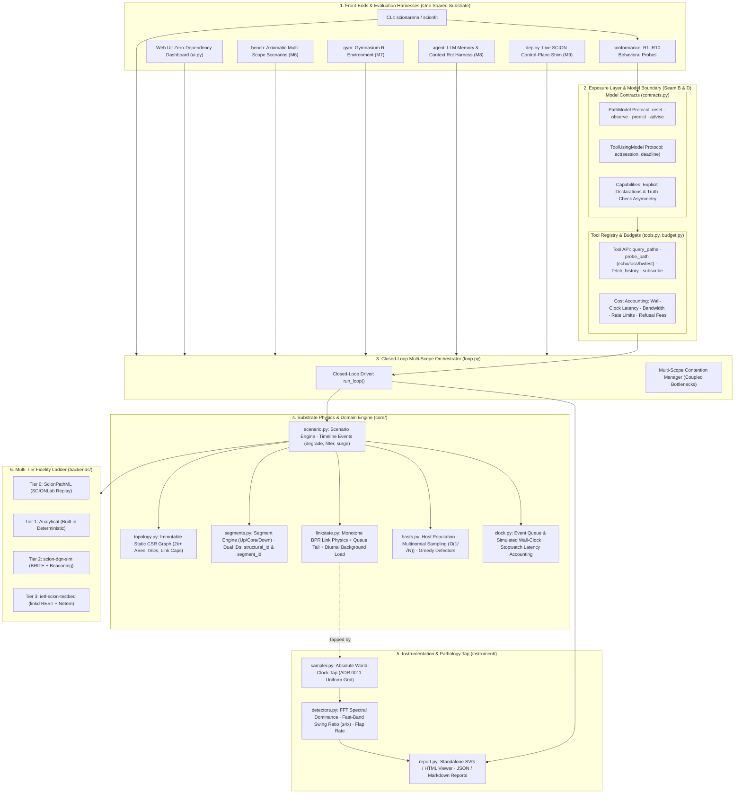

# scionfit

**Conformance and fit checking for SCION path-selection models.**

Existing SCION benchmarks answer *"is your prediction accurate?"*
`scionfit` answers a different question: **"does your model survive being deployed alongside other copies of itself?"**

Those are not the same question, and only one of them is currently askable.

---

## The problem this exists for

A path oracle publishes advice. Hosts act on it. Acting on it changes the network. The next round of measurements describes a network that the previous round of advice created.

That means a model can be accurate on recorded data and still be unusable, because accuracy on a fixed dataset says nothing about behaviour in a loop. Concretely: a model that always names the single best path will score well on an offline recommendation benchmark and will cause a stampede in deployment.

`scionfit` probes for that class of defect before you deploy anything.

---

## Install

```bash
pip install -e ".[dev]"
```

No required dependencies. Python 3.11+.

Optional extras: `[report]` for the PDF (matplotlib, reportlab), `[trees]` for the
gradient-boosted reference model (scikit-learn), `[dev]` for the test and lint tooling.
Nothing in `core/` needs anything beyond numpy, and the language-model adapter uses the
standard library rather than a vendor SDK -- a benchmark that needed one would carry that
SDK's version in every result file.

## Use

The package is `scionarena` and conformance is one front-end on it. The `scionfit`
command is kept as an alias for that front-end.

```bash
scionarena conformance list                 # built-in reference models
scionarena conformance check reference      # the compliant reference implementation
scionarena conformance check ema            # the Path Oracle style incumbent
scionarena conformance compare              # every reference model, side by side
scionfit check my.module:MyModel --format markdown --out report.md
```

Your own model is named by an import path, and every command that takes a model takes one:
a built-in name, `mypackage.mymodule:MyModel` once your code is installed, or
`./my_model.py:MyModel` if you have a single file and have packaged nothing.

```bash
scionarena models                           # the built-in names, and what they resolve to
scionarena models ./my_model.py:MyModel     # does it load, and what will it be tested on?
scionarena demo --models "./my_model.py:MyModel,reference"
```

`scionarena models` builds no scenario and runs no round, so a wrong import path or a
missing method costs a second rather than the length of a run. It prints which probes your
`Capabilities` declaration turns on and which it records as `DECLARED_ABSENT`. Loading runs
your module in this process, exactly as `import` would: do not load a spec you do not
trust. `docs/MODELS.md` has a fifteen-line worked example.

The closed loop, and the result it exists to produce:

```bash
scionarena ui                                            # a browser, with the knobs
scionarena cockpit                                       # watch a sweep while it happens
scionarena demo                                          # smoke tier, ~10 s
scionarena demo --tier dev --scopes 40 --slow 8          # add a deliberately slow model
scionarena demo --tier realistic --scopes 100 --cycles 80
```

`scionarena cockpit` is the interface for a *sweep* rather than a single run. It prints the
cell count and a time estimate before you press run, and beside them everything the
selection leaves out; it renders whatever is in the metric, axis, probe and baseline
registries rather than a list of its own; and it shows the three deltas of one decision
round on one timeline -- what the model was shown, what it did, and what the world did
back. Frames are dropped rather than the run being slowed to deliver them, and a dropped
frame is marked and never interpolated.

Two reference models over one scenario, one seed and one set of scopes — nothing differs
but the model — and a self-contained `report.html` of what each did to the network.
Committed runs are in `docs/evidence/`; what they show, and the one criterion they do not
meet, is in `docs/milestones/M3.md`.

In Python:

```python
from scionarena import check
from my_project import MyOracle

card = check(MyOracle(), seed=0, repeats=5)
print(card.to_terminal())
print(card.verdict)  # CONFORMANT | PARTIAL | OPEN-LOOP ONLY | ...
print(card.closed_loop_ready)  # can this be meaningfully stability-tested?
```

## Implement the interface

One class, four methods. A twenty-line moving average can satisfy it; that is a design constraint, not an accident.

```python
from scionarena import Capabilities, Dist, Prediction, Advisory


class MyOracle:
    capabilities = Capabilities(
        name="MyOracle",
        version="0.1",
        distributional=True,  # declare only what you actually do
        demand_conditioned=True,
        emits_assignment=True,
    )

    def reset(self, topo, seed=0): ...
    def observe(self, obs, topo): ...
    def predict(self, topo, paths, horizon_s=0.0, demand=None): ...
    def advise(self, topo, paths, sla, n_hosts=1): ...
```

**Declaring a limitation is free. Declaring a capability you do not have is the one thing scored as worse than failing.** An honest `demand_conditioned=False` gets you `DECLARED_ABSENT` and a note. A false `True` gets you `FALSE_CLAIM`, because a wrong declaration silently corrupts every downstream comparison that trusts it.

---

## The ten probes

Each probe changes exactly one thing and watches what the model does. Probes never compare two models against each other, only one model against itself under a controlled change, which is what makes results portable across model families.

| | Requirement | What the probe actually does |
|---|---|---|
| **R1** | Operates on a graph | Degrades one shared link; checks predictions move for paths using it and not for paths that do not |
| **R2** | Paths are first-class | Builds a path from links you have observed but that was never measured as a unit; asks for a prediction |
| **R3** | Handles sparse, irregular data | Feeds the same metric as *missing* and as *observed zero*; identical output is a failure |
| **R4** | Survives identity churn | *v0.1 tests the wrong thing — see below.* Introduces interfaces that did not exist at reset. Being rewritten: re-signs a path so its identifier changes while its interface sequence does not, and checks the model does not silently discard its history |
| **R5** | Distributional output | Checks for ≥3 ordered quantiles per metric, not a point estimate |
| **R6** | Conditions on demand | Same state, uniform vs 95%-concentrated demand; identical predictions mean the model cannot see its own effect |
| **R7** | Monotone in load | Sweeps demand upward and checks predicted cost never falls |
| **R8** | Emits an assignment | Checks `advise()` returns a distribution rather than a one-hot |
| **R9** | Self-consistent | Takes the advisory, computes the load it induces, re-asks, and measures how far the answer moved |
| **R10** | Degrades with staleness | Withholds observations for 600 s; checks the advisory relaxes and confidence falls |

> **Known defect in v0.1.** R4 was built on the assumption that inter-AS links appear and
> disappear on the timescale of an hour. That is wrong: the physical topology is stable and
> what churns is the *cryptographic material* of a beaconed path segment. The rewritten
> probe is specified in `docs/milestones/M5.md` and the correction in
> `docs/adr/0002-static-links-crypto-churn.md`.

Verdicts: `CONFORMANT`, `PARTIAL`, `OPEN-LOOP ONLY`, `MISDECLARED`, `ERRORED`.

`OPEN-LOOP ONLY` is not an insult. It means the model can be benchmarked on prediction accuracy but not meaningfully on stability, because it cannot represent the effect of its own advice, so a closed-loop test would only restate that fact.

---

## System Architecture



---

## Where this sits relative to existing work

`scionfit` does not reimplement SCION. It layers on top of tools that already exist and are better at their jobs than anything we would write.

| Tier | Backend | What it gives | Speed |
|---|---|---|---|
| 0 | [ScionPathML](https://arxiv.org/abs/2509.07154) | real SCIONLab measurements, replayed | instant |
| 1 | built in | analytical link model, fully deterministic | ms, thousands of runs |
| 2 | [scion-dqn-sim](https://github.com/netsys-lab/scion-dqn-sim) | BRITE topologies, simulated beaconing | minutes |
| 3 | [ietf-scion-testbed](https://github.com/netsys-lab/ietf-scion-testbed) | a real SCION stack, shaped through `linkd` | hours |

The design goal is that **one scenario definition drives all four tiers.** Tier 3 is what makes that worth doing: `linkd` exposes `tc netem/tbf` over REST, so the same perturbation that degrades a link in the analytical world can degrade a real inter-AS link on real hardware. That makes the sim-to-real gap measurable instead of assumed.

**What each existing tool already does better than us, and which we therefore call rather than copy:** ScionPathML has the real data and the open-loop task definitions. scion-dqn-sim has BRITE topology generation and control-plane beaconing. ietf-scion-testbed has an actual SCION deployment. What none of them has is more than one agent acting on the advice at the same time, which is the only thing `scionfit` adds.

---

## Status

**v0.1, alpha.** Honest about what is and is not done.

Working: the interface, all ten probes, the tier-1 world, four reference models, report rendering, CLI, tests, CI.

Stubbed and explicitly not yet trustworthy: all three external adapters. The type mappings are written and the call shapes are fixed, but none has been validated against a live export or a running instance. See `docs/ADAPTERS.md`. Do not report tier 0/2/3 numbers until those are checked.

Not yet built: the closed-loop benchmark tier (many agents, contention, oscillation metrics, axiomatic scoring). The conformance layer is a prerequisite for it and ships first.

The tier-1 world is a deliberately small analytical model, not a network simulator. It models carefully exactly one thing: cost rises with load, and paths sharing a link are coupled. That is enough to interrogate a model's structure and not enough to draw performance conclusions from.

## Contributing

See `CONTRIBUTING.md`. New probes are welcome and must come with at least one reference model that fails them, because a probe nothing fails is not measuring anything.

## Licence

MIT.

---

## Where this is going

`scionfit` v0.1 is the conformance seed of a larger system, **scionarena**: a harness that
exposes a realistic-scale SCION network to a centrally deployed AI recommendation node,
with raw access, costed tools, a closed loop, and measurement of the AI's own operational
behaviour.

Start with **`CLAUDE.md`**, then **`docs/HANDOFF.md`**, then the milestone you are working
on in `docs/milestones/`.

M0–M3 have landed: the tree is in the target layout and the import direction
(`core <- exposure <- instrument <- {conformance, bench, gym, agent, deploy}`) is enforced
by `lint-imports` in CI rather than by review; the substrate beacons, composes paths and
carries load; models reach it only through costed, rate-limited tools; and the loop is
closed, so advice moves hosts, hosts move link state, and link state moves the next
observation.

```
src/scionarena/
  core/          substrate       (trace hashing only until M1)
  exposure/      contracts       the only thing a model touches
  backends/      tiers 0-3
  conformance/   probes, runner, report card
  reference/     four models, deliberately simple
  instrument/ bench/ gym/ agent/ deploy/     empty until M4-M9
```

Note that `docs/DESIGN.md` describes v0.1 as built. `docs/HANDOFF.md` supersedes it where
they disagree — in particular the churn model, which was wrong in v0.1 and is corrected in
`docs/adr/0002-static-links-crypto-churn.md`.
