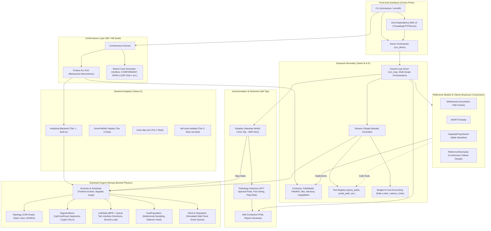

# Current Architecture (Milestones M0 – M4)

> Status: **Implemented & Verified** across 400 unit/integration tests and benchmarks.

---

## 🏛️ System Architecture Diagram (As-Built)

---

## 🔍 Detailed Component Interactions

### 1. The Closed Loop Execution Sequence
1. **Clock Advance**: The [`Clock`](file:///C:/Users/Von/Desktop/PAS_Research_desktop/PAS_Research_desktop/scionfit/src/scionarena/core/clock.py) steps the substrate by $\Delta t$, applying background diurnal loads and timeline perturbations.
2. **Observation Generation**: Telemetry from host transmissions and scheduled probes is placed into the model's observation queue.
3. **Model Invocation & Stopwatch**: The model's `advise()` or `act()` method is executed while a [`Stopwatch`](file:///C:/Users/Von/Desktop/PAS_Research_desktop/PAS_Research_desktop/scionfit/src/scionarena/core/clock.py#L321) measures elapsed decision time $\tau_{\text{decision}}$.
4. **Delayed Advisory Application**: An `advisory_apply` event is scheduled at $t_{\text{now}} + \tau_{\text{decision}}$.
5. **Host Resampling**: When the event fires, the [`HostPopulation`](file:///C:/Users/Von/Desktop/PAS_Research_desktop/PAS_Research_desktop/scionfit/src/scionarena/core/hosts.py) draws paths via `numpy.random.multinomial`.
6. **Realised Load on Links**: Link offered load is recalculated by accumulating host traffic across path interfaces.
7. **BPR Metric Calculation**: [`LinkState`](file:///C:/Users/Von/Desktop/PAS_Research_desktop/PAS_Research_desktop/scionfit/src/scionarena/core/linkstate.py) updates latencies, packet losses, and queueing delays.
8. **World-Clock Sampling**: The [`Sampler`](file:///C:/Users/Von/Desktop/PAS_Research_desktop/PAS_Research_desktop/scionfit/src/scionarena/instrument/sampler.py) records metrics at fixed simulated world time $t = k \cdot T_{\text{sample}}$, completely independent of model overruns.

---

## 📊 Current Structural Properties

* **Zero Python Objects per Path in Hot Loop**: State is stored in 1D contiguous NumPy arrays.
* **Deterministic Trace Hashing**: State digests generated via Blake2b hashing of arrays and event logs.
* **Separation of Contracts**: Models import only plain Python contracts from `scionarena.exposure.contracts` without any direct substrate dependencies.
