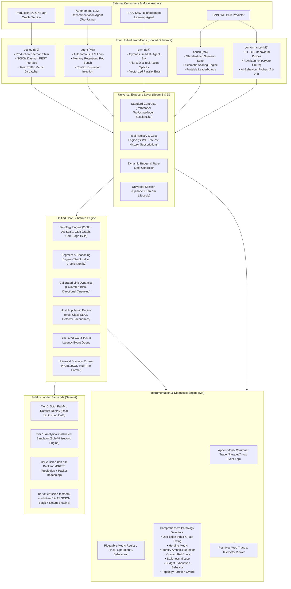

# Proposed Architecture (Target: Milestones M5 – M9)

> **The Vision**: A unified evaluation, training, and deployment platform for SCION AI Path Oracles across four fidelity tiers, supporting offline benchmark suites, reinforcement learning (Gymnasium), LLM agent pathology diagnostics, and live testbed deployment.

---

## 🏛️ Target Architecture Diagram (Full Vision)

---

## 🎯 The 4 Front-Ends Built on One Substrate

The core thesis of `scionarena` is that **a model trained in `gym`, verified in `conformance`, and scored in `bench` must deploy into `deploy` without changing a single line of code**.

| Front-End | Purpose | Primary Evaluation Output |
| :--- | :--- | :--- |
| **`conformance`** (M5) | Verifies whether a model meets the structural prerequisites for closed-loop stability. | Report Card: `CONFORMANT`, `PARTIAL`, `OPEN-LOOP ONLY`, `MISDECLARED`. |
| **`bench`** (M6) | Reproducible benchmark suite across standardized network scenarios. | Composite benchmark score, QoE compliance, efficiency vs. capacity floor. |
| **`gym`** (M7) | High-performance Reinforcement Learning environment (Gymnasium compatible). | RL training trajectories, reward curves, multi-agent policy convergence. |
| **`agent`** (M8) | Evaluates LLM reasoning agents with costed tool calling. | Context degradation curve, token/cost efficiency, memory retention rate. |
| **`deploy`** (M9) | Production daemon driving real SCION infrastructure. | Real-time advisory broadcast via SCION control plane. |

---

## 🪜 The 4 Fidelity Ladder Tiers

A single unified scenario definition (JSON/YAML) drives all four tiers:

1. **Tier 0 (Replay)**: Replays real SCIONLab network traces from ScionPathML. Instant execution.
2. **Tier 1 (Analytical)**: Pure NumPy BPR queueing simulation. Thousands of episodes in milliseconds.
3. **Tier 2 (DQN Simulator)**: Uses `scion-dqn-sim` with BRITE topologies and simulated control-plane packet flooding.
4. **Tier 3 (Hardware Testbed)**: Connects to a live 12-AS SCION deployment via the `linkd` REST interface to apply real `tc netem/tbf` interface rate and delay shaping.
