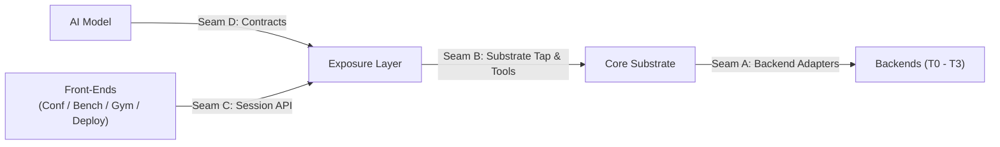

# Seams and Architectural Boundaries

> **The Seams**: Four critical isolation boundaries that allow any component to be swapped or upgraded without breaking the system.

---

---

## 🛡️ Seam A: Substrate ↔ Backend
* **Purpose**: Isolates *what* happens in a network scenario from *how faithfully* it is computed.
* **Invariant**: The scenario engine and substrate define topology, events, and metrics; backends implement the computation (pure analytical, simulated packet beaconing, or real `linkd` hardware shaping).
* **Protection**: Nothing tier-specific or backend-specific is permitted to leak into `core/`.

---

## 🛡️ Seam B: Substrate ↔ Exposure
* **Purpose**: Isolates raw ground truth in NumPy arrays from what an AI model is permitted to see and do.
* **Invariant**: An AI model never receives direct references to substrate state. All information must pass through **costed tools** or **asynchronous observation streams**.
* **Protection**: Enforced by strict rate-limiters, cost calculators, and simulated wall-clock latency.

---

## 🛡️ Seam C: Exposure ↔ Front-End
* **Purpose**: Ensures that all four front-ends (`conformance`, `bench`, `gym`, `deploy`) drive identical session objects.
* **Invariant**: A front-end requiring new substrate interactions must define a **new tool in the tool registry**, not a custom backdoor into `core/`.

---

## 🛡️ Seam D: Model ↔ Everything Else
* **Purpose**: Ensures complete model-agnosticism.
* **Invariant**: A model implements [`PathModel`](file:///C:/Users/Von/Desktop/PAS_Research_desktop/PAS_Research_desktop/scionfit/src/scionarena/exposure/contracts.py#L351) or [`ToolUsingModel`](file:///C:/Users/Von/Desktop/PAS_Research_desktop/PAS_Research_desktop/scionfit/src/scionarena/exposure/contracts.py#L450) and touches only [`contracts.py`](file:///C:/Users/Von/Desktop/PAS_Research_desktop/PAS_Research_desktop/scionfit/src/scionarena/exposure/contracts.py). It never imports `scionarena.core` or `scionarena.backends`.
* **Enforcement**: Proven in CI via `import-linter` rules in `pyproject.toml`.
