```mermaid
graph TD
    Start["Design Problem: SCION AI Path Oracle Evaluation Harness"] --> Q_Domain["Domain Modeling: How does the network churn?"]

    %% Domain Decision
    Q_Domain -->|"Old v0.1 Assumption (Wrong)"| D_OldChurn["Hourly Link Appearance / Disappearance<br>❌ Rejected: Physical links are stable"]
    Q_Domain -->|"Corrected Domain (ADR 0002)"| D_CryptoChurn["Static Links + Cryptographic Segment Churn<br>✅ Accepted: ADR 0002"]

    D_CryptoChurn --> Q_Identity["How to identify paths across re-signing?"]
    Q_Identity -->|"Unresolved Q1"| D_DualID["Support Dual IDs:<br>• structural_id (stable hash)<br>• segment_id (crypto-bound)<br>✅ Accepted: ADR 0005"]

    %% Scale & Performance
    Start --> Q_Scale["Scale Target: Realistic Tier (2,000 ASes, 10,000 links)"]
    Q_Scale --> D_Arrays["NumPy Array Storage (CSR Adjacency)<br>❌ No Python objects per path in hot loop<br>✅ Accepted: ADR 0004"]
    Q_Scale --> D_LazyPaths["Lazy Scope Path Materialization & LRU Caching<br>✅ Accepted: ADR 0005"]

    %% Link Model
    Start --> Q_LinkModel["Link Congestion: How to turn load into metrics?"]
    Q_LinkModel -->|"Queueing Formula (M/M/1)"| D_MM1["1/(1-u) queueing<br>❌ Rejected: Ignores provisioning & lacks calibration knobs"]
    Q_LinkModel -->|"Piecewise Linear"| D_PWL["Piecewise Table<br>❌ Rejected: Overfits sparse data"]
    Q_LinkModel -->|"BPR + Queue Tail (ADR 0006)"| D_BPR["BPR + Sharp Buffer Tail<br>✅ Monotone non-decreasing cost in load<br>✅ Calibratable via fit_bpr (M9)"]

    %% Traffic & Closed Loop
    Start --> Q_Loop["Closed Loop: How do hosts act on advice?"]
    Q_Loop --> D_HostSampling["Independent Multinomial Sampling<br>✅ O(1/√N) concentration<br>✅ Defector fractions hook (ADR 0009)"]
    D_HostSampling --> Q_Clock["How to handle model inference latency?"]
    Q_Clock --> D_SimClock["Simulated Wall-Clock Event Queue<br>✅ Advisory lands at now + decision_latency<br>❌ Never pause the world (Invariant 3)"]

    %% Exposure Layer
    Start --> Q_Exposure["Exposure Boundary: How does AI interact?"]
    Q_Exposure --> D_CostedTools["JSON Schema Tool Registry + Strict Costs<br>✅ Probes consume units & delay<br>✅ Refused calls cost CPU (ADR 0008)"]
    Q_Exposure --> D_PlainContracts["Zero-Dependency Contracts (contracts.py)<br>✅ 20-line baseline can implement<br>✅ Capabilities Declaration Asymmetry"]

    %% Instrumentation & Measurement
    Start --> Q_Measurement["Instrumentation: How to detect pathologies?"]
    Q_Measurement --> Q_Sampling["When to sample time series?"]
    Q_Sampling -->|"Sample per decision round (M3)"| D_M3Sample["Variable cadence grid<br>❌ Distorts spectra when models overrun"]
    Q_Sampling -->|"Sample on world clock (ADR 0011)"| D_M4Sample["Fixed Interval Absolute Time Tap<br>✅ Uniform grid, scale-independent (ADR 0011)"]

    Q_Measurement --> Q_OscMetric["How to quantify oscillation?"]
    Q_OscMetric -->|"Peak Dominance > 0.5 (M3)"| D_DomFail["FFT Spectral Dominance<br>⚠️ Scale-unstable across grid rates (ADR 0010)"]
    Q_OscMetric -->|"Swing Amplitude Ratio (ADR 0010)"| D_SwingPass["Fast-Band Peak-to-Peak Swing Ratio (≥4x)<br>✅ Scale-invariant discrimination"]

    %% Fidelity Ladder
    Start --> Q_Fidelity["Sim-to-Real: How to bridge the fidelity gap?"]
    Q_Fidelity --> D_Ladder["4-Tier Fidelity Ladder (One Scenario Schema):<br>• Tier 0: Replay (ScionPathML)<br>• Tier 1: Analytical (BPR)<br>• Tier 2: dqn-sim (BRITE)<br>• Tier 3: ietf-scion-testbed (linkd netem)"]
```

# Architecture & Design Choices Decision Tree

> A comprehensive visual decision tree mapping the fundamental engineering, domain, and mathematical decisions made in `scionarena` / `scionfit`.

---

---

## 📑 Detailed Decision Log

| Decision ID | Domain / Scope | Decision Made | Key Reason | Alternatives Rejected |
| :--- | :--- | :--- | :--- | :--- |
| **ADR 0002** | Topology Dynamics | Physical links static; crypto segments churn | Aligns with SCION control-plane realities | Hourly link churn model (v0.1) |
| **ADR 0004** | Codebase Layout | Enforce $\text{core} \leftarrow \text{exposure} \leftarrow \text{frontends}$ | Clean seams, automated CI linting | Circular convenience imports |
| **ADR 0005** | Path Identity | Expose dual `structural_id` and `segment_id` | Unresolved Q1; catches identity amnesia | Hardcoding single path identifier |
| **ADR 0006** | Link Physics | BPR formula + nonlinear queueing buffer tail | Monotone non-decreasing; matches link buffer knees | M/M/1 queueing, piecewise linear |
| **ADR 0007** | Scenario Schema | Portable JSON/YAML driving all 4 tiers | Single scenario drives analytical and hardware testbed | Ad-hoc tier-specific configs |
| **ADR 0008** | Tooling & Costs | Differentiated tool costs & rate limits | Balances information gain vs. budget consumption | Flat cost per call; free queries |
| **ADR 0009** | Closed Loop | Multinomial host sampling + delayed advice apply | $O(1/\sqrt{N})$ concentration; enforces Invariant 3 | Instantaneous state feedback |
| **ADR 0010** | Oscillation Metric | Swing amplitude ratio ($\ge 4\times$) as headline | Spectral peak dominance is sample-rate dependent | Raw peak dominance $> 0.5$ |
| **ADR 0011** | Instrumentation | Sample directly from substrate on world clock | Prevents grid distortion during model latency overruns | Sampling once per decision round |
